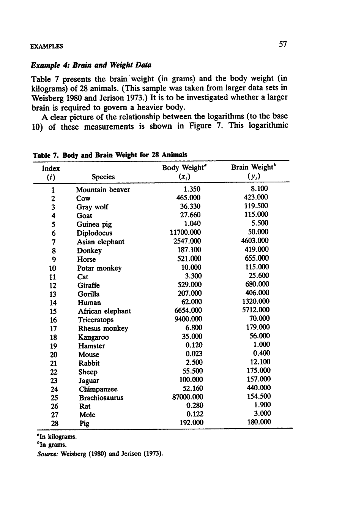
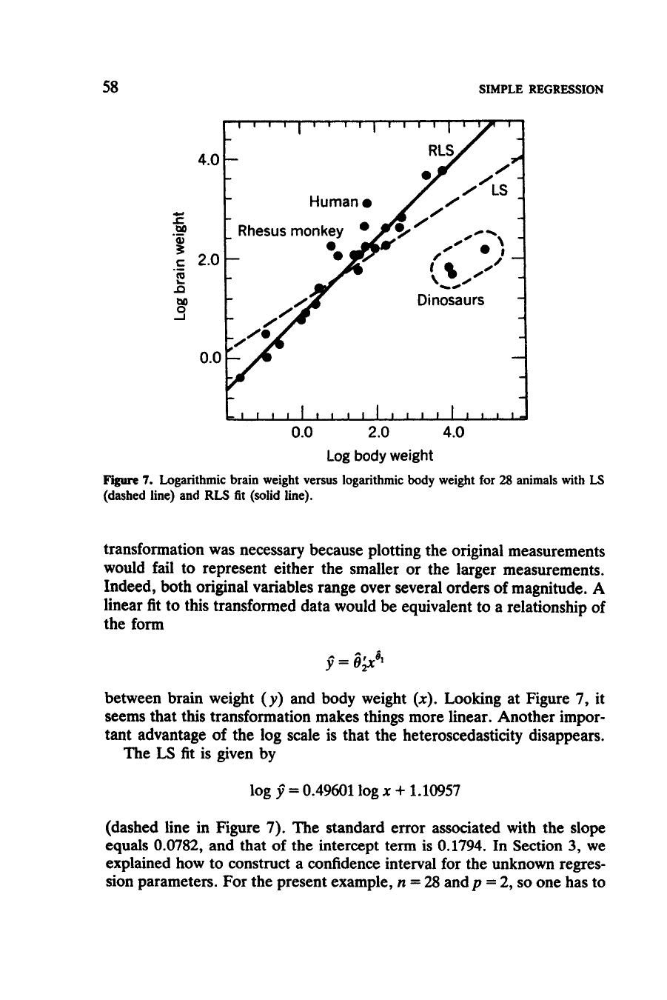

# Appendix {.unnumbered}

## Example chapter {#sec-rousseeuw}

The example we use is a chapter on robust regression from @rousseeuw1987 out of the book *Robust Regression and Outlier Detection*. 
You can download the relevant chapters [here](images/simple_regression_example_4.pdf), the relevant sections are displayed in @fig-roussseeuw1 and -@fig-roussseeuw2. To make things easier, we provide you with the plain (unformatted) text below.

In addition, you can download [`Animals.csv`](Animals.csv) (right click → save as) which contains the data for the example. The image [brain-vs-body.png](images/brain-vs-body.png) shows the plot of brain weight vs body weight.


:::{layout-ncol=2 .column-page-inset}

{#fig-roussseeuw1}

{#fig-roussseeuw2}

:::


```{.markdown}

Example 4: Brain and Weight Data

Table 7 presents the brain weight (in grams) and the body weight (in
kilograms) of 28 animals. (This sample was taken from larger data sets in
Weisberg 1980 and Jerison 1973.) It is to be investigated whether a larger
brain is required to govern a heavier body. 
  A clear picture of the relationship between the logarithms (to the base
10) of these measurements is shown in Figure 7. This logarithmic 

- placeholder for the table - 

- placeholder for the plot - 

transformation was necessary because plotting the original measurements
would fail to represent either the smaller or the larger measurements.
Indeed, both original variables range over several orders of magnitude. A
linear fit to this transformed data would be equivalent to a relationship of
the form

- placeholder for equation -


between brain weight (y) and body weight (x). Looking at Figure 7, it
seems that this transformation makes things more linear. Another impor-
tant advantage of the log scale is that the heteroscedasticity disappears.
  The LS fit is given by

- placeholder for equation -

(dashed line in Figure 7). The standard error associated with the slope
equals 0.0782, and that of the intercept term is 0.1794. In Section 3, we
explained how to construct a confidence interval for the unknown regres-
sion parameters. For the present example, n = 28 and p = 2, so one has to
use the 97.5% quantile of the t-distribution with 26 degrees of freedom,
which equals 2.0555. Using the LS results, a 95% confidence interval for
the slope is given by t0.3353; 0.65673. The RLS yields the solid line in
Figure 7, which is a fit with a steeper slope:

- placeholder for equation -


``` 